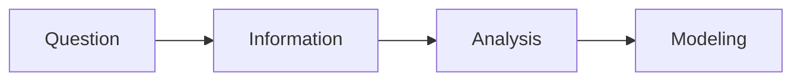
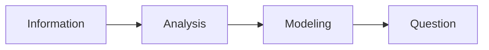

*This is for study and training for class Bioinformatics in Action 2024, Tsinghua University*

# Getting started

## 4 steps of bioinformatics

### Question

#### Top 5 questions in *Science* 2005

1. what is the universe made of ?
2. what is the biological basis of consciousness?
3. why do humans have so few genes?
4. to what extent are genetic variation and personal health linked?
5. can the laws of physics be unified?

#### Top 3 philosophy questions

- what is life
- what is mind
- how universe works

### Information

#### Images

- Fluorescences
- Locations 
- 3D structures
- docking

#### Sequence

- DNA-seq

- RNA-seq

- Epigenetics

  - DNAase
  - Methylation
  - Histone modifications: ChIP-seq

- Interaction

  - Protein-DNA: ChIP-seq
  - Protein-RNA: CLIP-seq
  - DNA-RNA: Grid-seq

  

### Analysis

two keys: ==Data Clean & Feature Extraction==

### Modeling

#### Types

- Math
  - Eg: $y=w_0+\sum_{i=1}^{N}w_ix_i$
- physics
  - Eg: thermo dynamics
- ...

#### Model VS Algorithm

|           |                   purpose                    |      Method      |
| :-------: | :------------------------------------------: | :--------------: |
|   Model   |       transform real problem into math       | Math and physics |
| Algorithm | translate math into computer logic elegantly |      Logic       |

### The Fourth Paradigm

## Study Schedule

|    Date    |         Class         |                      My Own                       |
| :--------: | :-------------------: | :-----------------------------------------------: |
|  week 1-4  |  Basic Linux, Blast   |       Get familiar with docker, linux and R       |
|  week 5-9  |   NGS Data analysis   |           Strictly following the class            |
|  week 10   | Machine Learning & AI |  review python and strictly following the class   |
| week 11-16 |     SCS analysis      | follow the class while fulfilling the extra tasks |
