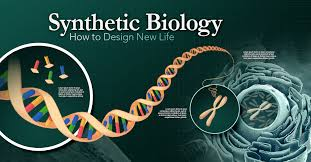

# About Me

Here is Weijie Li (Juice Lee, 李玮杰).

I am an undergrad majoring in biochemistry and biochemical engineering at Tsinghua University. Currently, I am leading an iGEM team focusing on RNA SenSor based Analysis system in Yeast(RNAssay), with the help of Pr. Li Chun.

If you are interested in any aspect of me, I would love to chat and collaborate, please email me at li-wj21@mails.tsinghua.edu.cn.

## Academic Background

- Sep 2024 - Future: Cambridge University (Incoming EE MPhil, supervised by Prof. Ozgur B. Akan)
- Sep 2020 - June 2024: Maynooth University (BSc, EECS)
- Sep 2020 - June 2024: Fuzhou University (BEng, EECS)
- June 2022 - Nov 2022: Cambridge University (Internship)

---

## Research Interests

- Metabolic Engineering
- RNA sensor design
- Developing basic part for synthetic biology
- Nano delivery system

My current research focuses on developing RNA SenSor based Analysis system in Yeast(RNAssa), which utilize ADAR as the key enzyme. My team is trying to apply this system into multiple application senarios like in situ multi-gene expression detection; engineering strain security system and dynamic monitoring of splice variant.

---

## News and Updates

