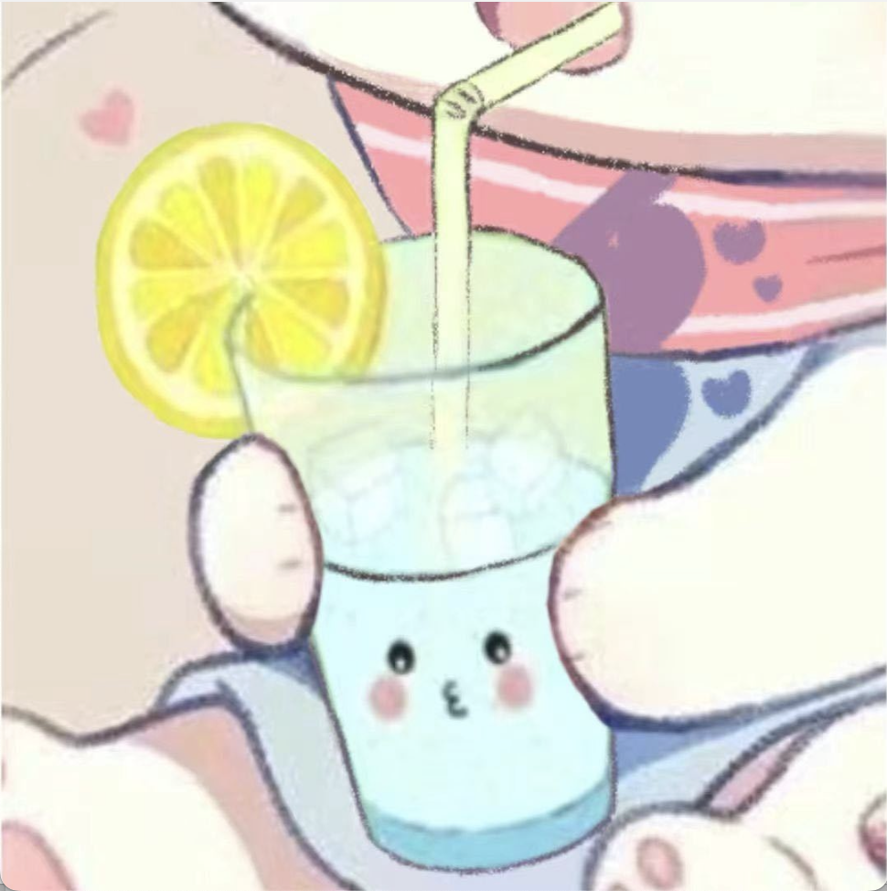

# About Me

Here is Weijie Li (Juice Lee, 李玮杰).

I am an undergrad majoring in biochemistry and biochemical engineering at Tsinghua University. Currently, I am leading an iGEM team focusing on RNA SenSor based Analysis system in Yeast(RNAssay), with the help of Pr. Li Chun.

If you are interested in any aspect of me, I would love to chat and collaborate, please email me at li-wj21@mails.tsinghua.edu.cn.

## Academic Background

- 2024.03~2024.10: Student leader of team Tsinghua-M competing for iGEM 2024, Tsinghua University, department of chemical engineering, Li Chun Lab.
- 2022.08~2024.02: Developing CD4+ T cells targeting LNPs, Tsinghua University, department of chemical engineering, Lu Yuan Lab.
- 2022.07～2022.08: Summer Training in National Institute of Biological Science, Beijing(NIBS), Chen Ting Lab,

---

## Research Interests

- Metabolic Engineering
- RNA sensor design
- Developing basic part for synthetic biology
- Nano delivery system

My current research focuses on developing RNA SenSor based Analysis system in Yeast(RNAssa), which utilize ADAR as the key enzyme. My team is trying to apply this system into multiple application senarios like in situ multi-gene expression detection; engineering strain security system and dynamic monitoring of splice variant.

